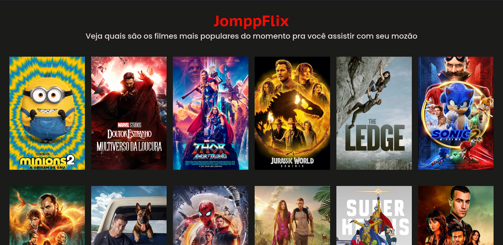

<h1 align="center">MovieDB</h1>

> Status do Projeto: Concluído :heavy_check_mark:
## Descrição do Projeto

Projeto desenvolvido durante o Núcleo de estudos Web da [InfoJr UFBA](https://br.linkedin.com/company/infojrufba) que consiste na construção de um catálogo de filmes recentes consumindo a API [TheMovieDB](https://www.themoviedb.org/).



### :hammer: Funcionalidades

- Exibição das informações do filme em um modal, ao clicar na capa;
- Paginação do catálogo através de setas (previous e next arrows);
- Paginação do catálogo através de input;

## :books: Frameworks, Libs e Dependências Utilizadas

- [Express](https://expressjs.com/pt-br/)
- [Nodemon](https://nodemon.io/)
- [Cross-fetch](https://www.npmjs.com/package/cross-fetch)

## 📁 Acesso ao Projeto

Para executar o projeto na sua máquina você precisa ter instalado o [Node.js](https://nodejs.org/en/).

### Como executar
Após [baixar]() ou clonar (necessita ter o git instalado) o repositório :
- Localize e navegue até a pasta do projeto no terminal (caso tenha sido baixado é necessário extraí-lo);
- No terminal execute os comandos: 
``` bash
# Instale as dependências
$ npm install

# Inicie o servidor da aplicação
$ npm run start
```
- Acesse o endereço http://localhost:3000 para acessar o site;